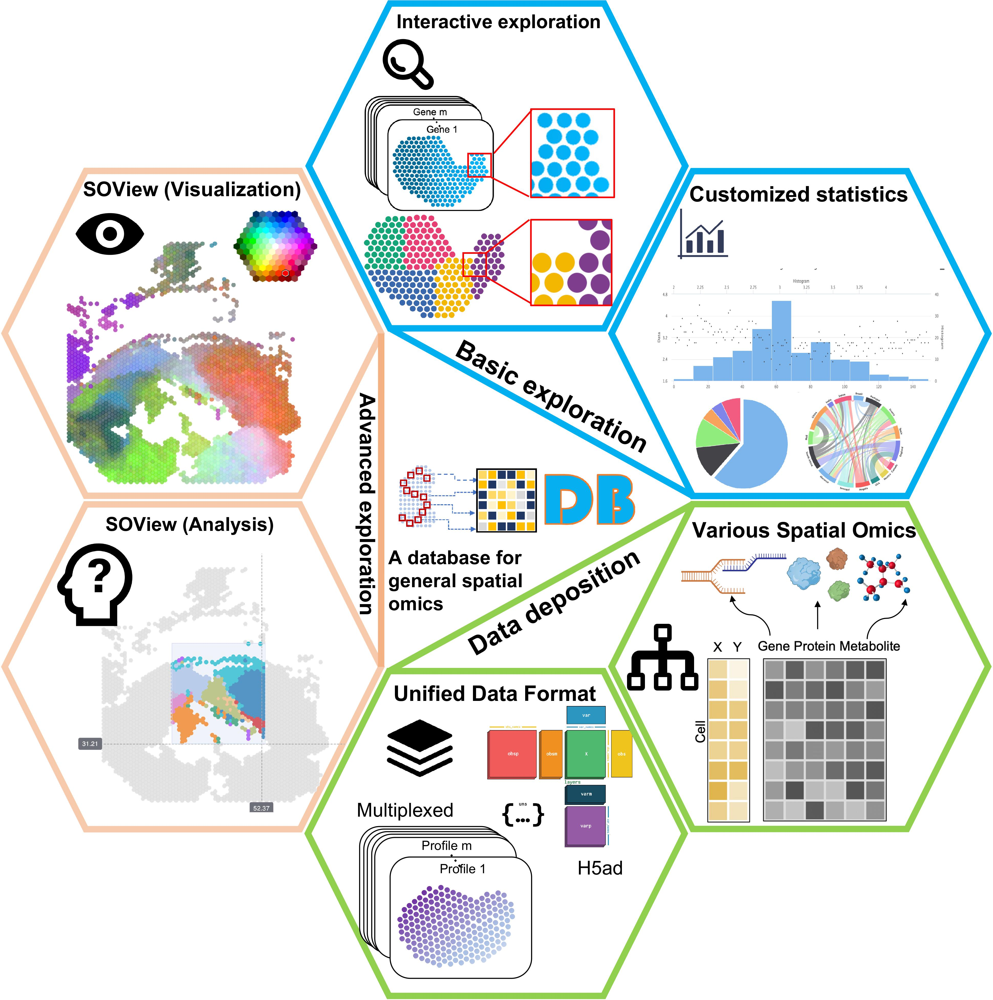

.. pysodb_tutorial documentation master file, created by
   sphinx-quickstart on Thu Sep 29 16:15:04 2022.
   You can adapt this file completely to your liking, but it should at least
   contain the root `toctree` directive.

pysodb
===========================================

Welcome to pysodb's documentation!

pysodb is a python package that provides the interface to get data in `SODB <https://gene.ai.tencent.com/SpatialOmics/>`_  .

.. toctree::
   :maxdepth: 1
   :caption: Contents:

   installation/installation
   api/api

.. toctree::
   :maxdepth: 2
   :caption: tutorial:

   scanpy/scanpy
   squidpy/squidpy

.. note:: Please consider citing this project in your publications if it helps your research.

 Yuan, Z., Pan, W., Zhao, X. et al. SODB facilitates comprehensive exploration of spatial omics data. Nat Methods (2023). https://doi.org/10.1038/s41592-023-01773-7